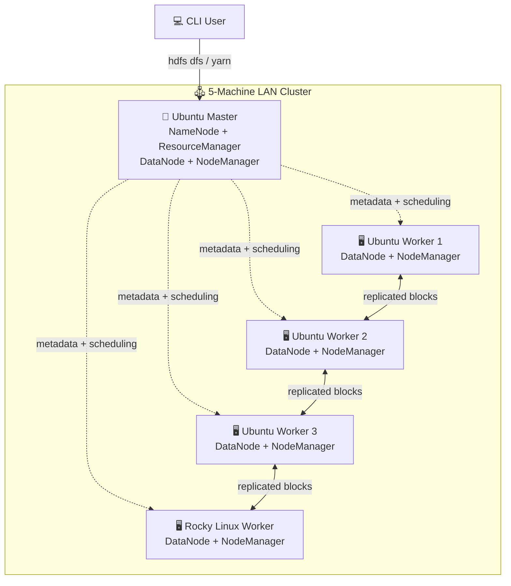
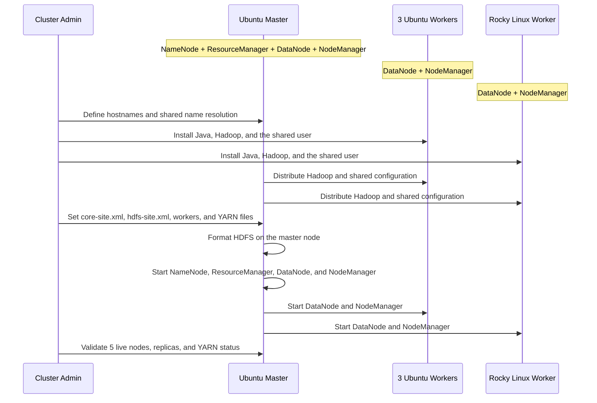

# HDFS — Hadoop Distributed File System LAN Deployment Guide

A documentation-oriented subproject focused on deploying **Apache Hadoop HDFS and YARN** on a **5-machine heterogeneous LAN cluster** using **Ubuntu and Rocky Linux**. The master machine runs both **NameNode + ResourceManager** and **DataNode + NodeManager**, while the remaining four machines contribute distributed storage and execution capacity. The complete report is available in [HDFS-LAN-Implementation-Guide-Ubuntu-RockyLinux.pdf](HDFS-LAN-Implementation-Guide-Ubuntu-RockyLinux.pdf).

## Architecture



## Document Scope

| Topic | Description |
|-------|-------------|
| HDFS fundamentals | NameNode/DataNode roles, metadata handling, block distribution, and replication |
| YARN integration | ResourceManager, NodeManagers, and the relationship between storage and distributed processing |
| Heterogeneous deployment | Compatibility considerations for Ubuntu and Rocky Linux in the same cluster |
| Cluster setup | Hostnames, SSH without passwords, Java, Hadoop installation, and XML configuration |
| Validation | Upload/download tests, block and replica verification, and basic fault-tolerance checks |
| Troubleshooting | Common issues such as missing DataNodes, SSH prompts, and `JAVA_HOME` errors |

## Implementation Workflow



## Representative Operational Commands

```bash
# Format the filesystem (first run only)
hdfs namenode -format

# Start distributed storage and processing services
start-dfs.sh
start-yarn.sh

# Create a user directory and upload a file
hdfs dfs -mkdir -p /user/hadup2
hdfs dfs -put sample.txt /user/hadup2/

# Validate cluster status and block placement
hdfs dfsadmin -report
hdfs fsck / -files -blocks -locations
```

## Laboratory Validation Highlights

The report documents a successful laboratory execution with the following observed results:

| Check | Observed result |
|-------|------------------|
| NameNode web interface | Active |
| Live nodes | 5 |
| Dead nodes | 0 |
| Under-replicated blocks | 0 |
| YARN validation | Containers distributed across cluster nodes |

## Project Structure

```text
HDFS/
├── README.md
└── HDFS-LAN-Implementation-Guide-Ubuntu-RockyLinux.pdf
```

## Technologies

- **Apache Hadoop HDFS** — Distributed file storage
- **YARN** — Cluster resource management
- **Java** — Runtime required by Hadoop
- **Linux (Ubuntu + Rocky Linux)** — Heterogeneous deployment environment
- **SSH** — Remote orchestration between nodes
