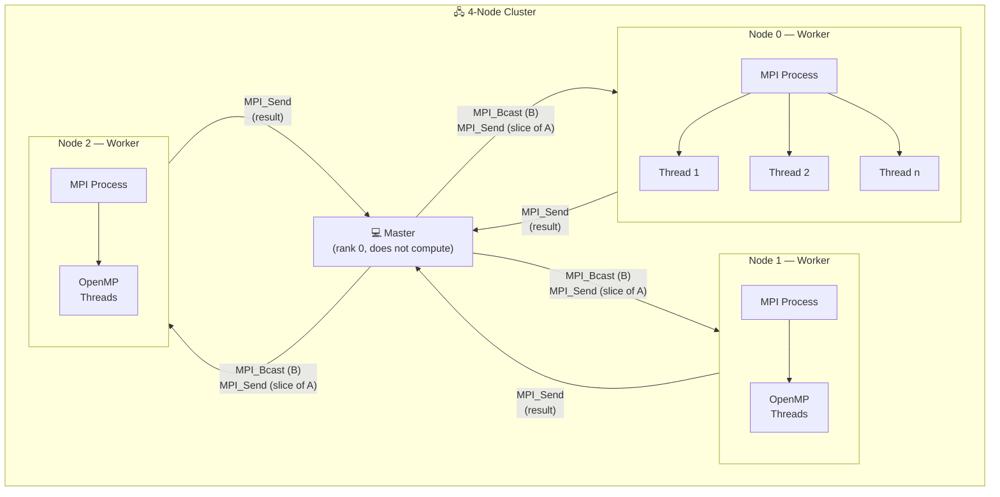
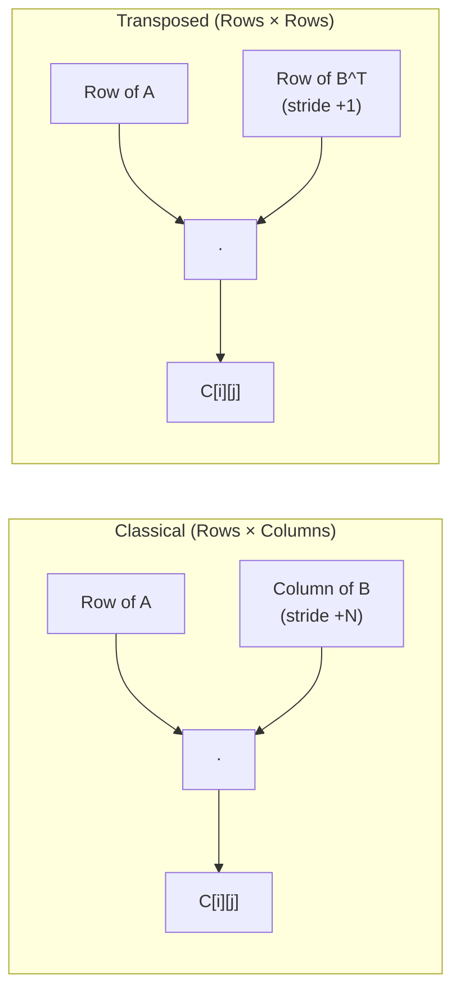
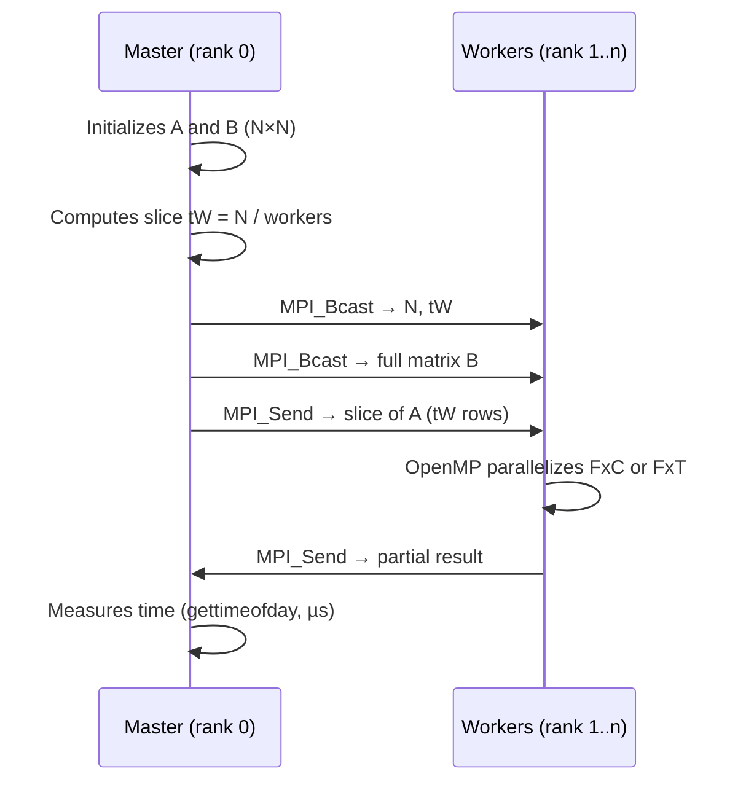

# MPI&OpenMP-PerformanceStudy — Hybrid MPI + OpenMP Performance Study

A square matrix multiplication performance study implemented in **C with MPI and OpenMP**, comparing the **classical algorithm (Rows × Columns)** against the **transposed variant (Rows × Transposed)**. Executed on a 4-node cluster with benchmark automation.

## Architecture



## Two Multiplication Strategies



| Algorithm | File | Access to B | Cache-friendly |
|-----------|---------|-----------|:--------------:|
| Classical (FxC) | `mxmOmpMPIfxc.c` | Columns (stride N) | ✗ |
| Transposed (FxT) | `mxmOmpMPIfxt.c` | Rows (stride 1) | ✓ |

The transposed variant converts `B` into `B^T` before multiplication, so both operands are traversed by rows (sequential memory access), making better use of the cache.

## Execution Flow



## Experimental Design

The `lanzadorMPI.pl` script runs **three experimental cases**, each with **30 repetitions** per configuration:

### Case 1 — MPI Process Variation

| Parameter | Values |
|-----------|---------|
| np (processes) | 5, 17, 33 |
| OpenMP threads | 1 (fixed) |
| Hostfile | `procesosHostfile` (multiple slots/node) |
| Sizes N | 400, 800, 1600, 3200 |

### Case 2 — OpenMP Thread Variation

| Parameter | Values |
|-----------|---------|
| np (processes) | 5 (fixed, 1/node) |
| OpenMP threads | 1, 4, 8 |
| Hostfile | `hilosHostFile` (1 slot/node) |
| Sizes N | 400, 800, 1600, 3200 |

### Case 3 — Baseline (Master only)

| Parameter | Values |
|-----------|---------|
| np (processes) | 2 (master + 1 worker, same node) |
| OpenMP threads | 1 |
| Sizes N | 400, 800, 1600, 3200 |

> Case 3 serves as the reference for calculating **speedup** and **efficiency**.

## Hostfiles

### `procesosHostfile` — Distribution by Processes
```
master  slots=9
nodo0   slots=8
nodo1   slots=8
nodo2   slots=8
```

### `hilosHostFile` — Distribution by Threads
```
master  slots=2
nodo0   slots=1
nodo1   slots=1
nodo2   slots=1
```

## Requirements

- **OpenMPI** (`mpicc`, `mpirun`)
- **GCC** with **OpenMP** support (`-fopenmp`)
- **Perl** (for the benchmarking script)
- Passwordless SSH configuration between cluster nodes

## Compilation

```bash
cd evalMxM_MPI
make
```

This generates two executables:
- `mxmOmpMPIfxc` — Classical algorithm (Rows × Columns)
- `mxmOmpMPIfxt` — Transposed algorithm (Rows × Transposed)

To clean:
```bash
make clean
```

## Execution

### Manual Execution (example)

```bash
# Classical: 5 processes, 800×800 matrices, 4 OpenMP threads
mpirun -hostfile procesosHostfile -np 5 --map-by node ./mxmOmpMPIfxc 800 4

# Transposed: same configuration
mpirun -hostfile procesosHostfile -np 5 --map-by node ./mxmOmpMPIfxt 800 4
```

### Automated Benchmark (all cases)

```bash
perl lanzadorMPI.pl
```

It generates `.dat` files in `resultadosDAT/` with times in microseconds. Example names:
- `Procesos-Pr-clasica-N-800-NP-17.dat`
- `Hilos-Pr-transpuesta-N-1600-NP-5-H-8.dat`
- `ProcesosMaster-Pr-clasica-N-3200-NP-2.dat`

## Project Structure

```
MPI&OpenMP-PerformanceStudy/
├── README.md
└── evalMxM_MPI/
    ├── Makefile                    # Compilation of both executables
    ├── moduloMPI.h                 # Auxiliary function prototypes
    ├── moduloMPI.c                 # Shared module (init, FxC, FxT, timing)
    ├── mxmOmpMPIfxc.c              # Main — Classical multiplication (FxC)
    ├── mxmOmpMPIfxt.c              # Main — Transposed multiplication (FxT)
    ├── lanzadorMPI.pl              # Perl automation script
    ├── procesosHostfile            # Hostfile: multiple slots per node
    ├── hilosHostFile               # Hostfile: 1 slot per node (threads)
    └── resultadosDAT/              # .dat files with times (µs)
```

## Technologies

- **C** — Implementation language
- **MPI (OpenMPI)** — Distributed communication between nodes (Send/Recv, Bcast)
- **OpenMP** — Intra-node parallelism (threads over the slices)
- **Perl** — Full experiment automation
- **gettimeofday()** — Time measurement in microseconds
