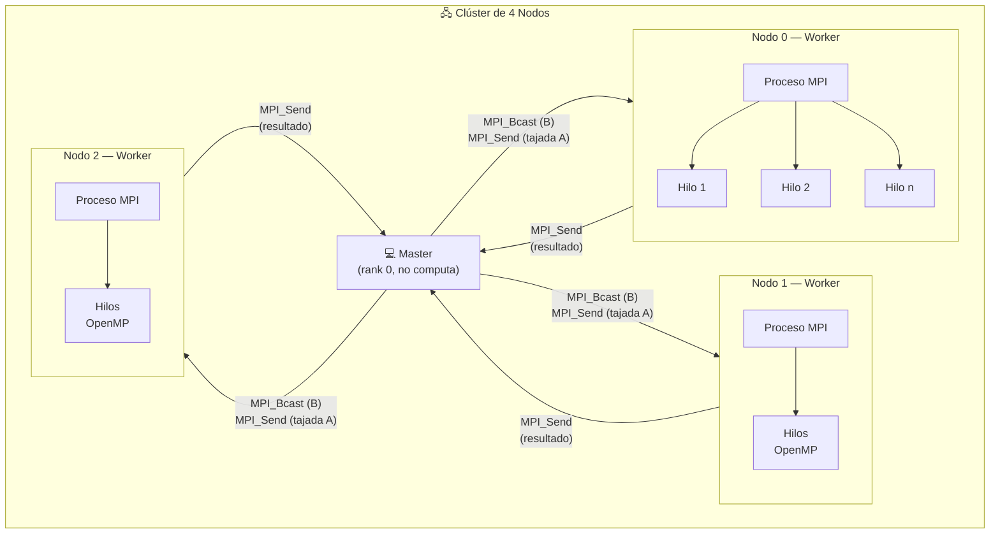
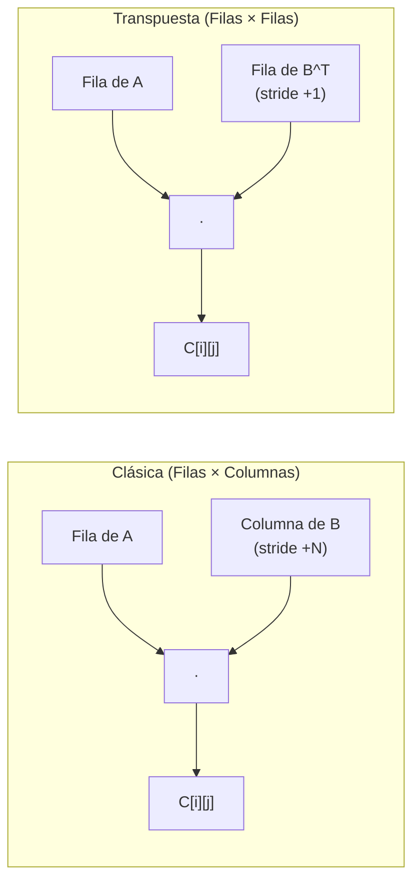
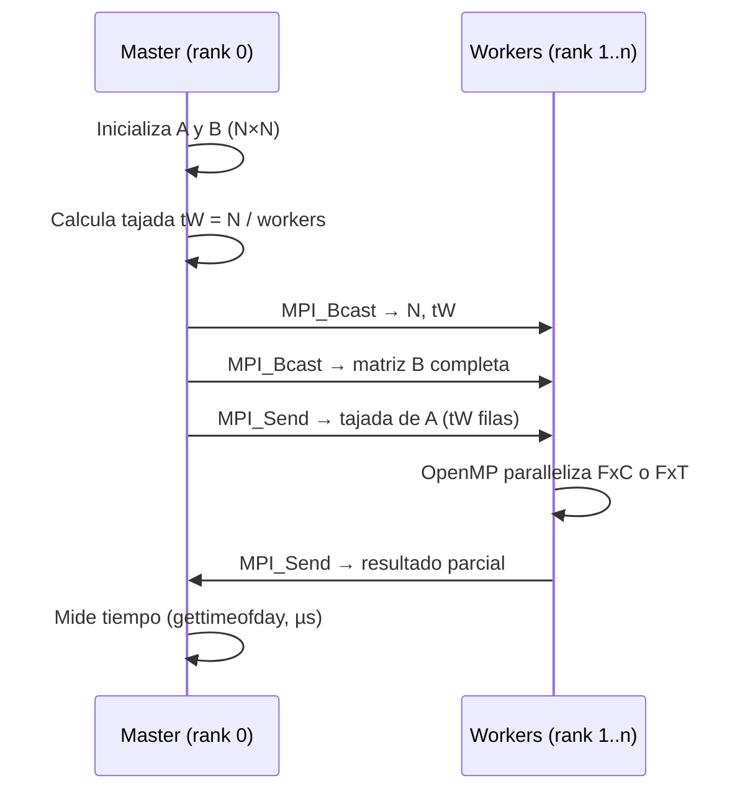

# MPI&OpenMP-PerformanceStudy — Estudio de Rendimiento Híbrido MPI + OpenMP

Estudio de rendimiento de multiplicación de matrices cuadradas implementado en **C con MPI y OpenMP**, comparando el algoritmo **clásico (Filas × Columnas)** contra la **variante con transposición (Filas × Transpuesta)**. Ejecutado sobre un clúster de 4 nodos con automatización de benchmarks.

## Arquitectura



## Dos estrategias de multiplicación



| Algoritmo | Archivo | Acceso a B | Cache-friendly |
|-----------|---------|-----------|:--------------:|
| Clásico (FxC) | `mxmOmpMPIfxc.c` | Columnas (stride N) | ✗ |
| Transpuesta (FxT) | `mxmOmpMPIfxt.c` | Filas (stride 1) | ✓ |

La variante transpuesta convierte `B` en `B^T` antes de multiplicar, de modo que ambos operandos se recorren por filas (acceso secuencial en memoria), aprovechando mejor la caché.

## Flujo de ejecución



## Diseño experimental

El script `lanzadorMPI.pl` ejecuta **tres casos experimentales**, cada uno con **30 repeticiones** por configuración:

### Caso 1 — Variación de procesos MPI

| Parámetro | Valores |
|-----------|---------|
| np (procesos) | 5, 17, 33 |
| Hilos OpenMP | 1 (fijo) |
| Hostfile | `procesosHostfile` (múltiples slots/nodo) |
| Tamaños N | 400, 800, 1600, 3200 |

### Caso 2 — Variación de hilos OpenMP

| Parámetro | Valores |
|-----------|---------|
| np (procesos) | 5 (fijo, 1/nodo) |
| Hilos OpenMP | 1, 4, 8 |
| Hostfile | `hilosHostFile` (1 slot/nodo) |
| Tamaños N | 400, 800, 1600, 3200 |

### Caso 3 — Línea base (solo Master)

| Parámetro | Valores |
|-----------|---------|
| np (procesos) | 2 (master + 1 worker, mismo nodo) |
| Hilos OpenMP | 1 |
| Tamaños N | 400, 800, 1600, 3200 |

> El caso 3 sirve como referencia para calcular **speedup** y **eficiencia**.

## Hostfiles

### `procesosHostfile` — Distribución por procesos
```
master  slots=9
nodo0   slots=8
nodo1   slots=8
nodo2   slots=8
```

### `hilosHostFile` — Distribución por hilos
```
master  slots=2
nodo0   slots=1
nodo1   slots=1
nodo2   slots=1
```

## Requisitos

- **OpenMPI** (`mpicc`, `mpirun`)
- **GCC** con soporte **OpenMP** (`-fopenmp`)
- **Perl** (para el script de benchmarking)
- Configuración SSH sin contraseña entre nodos del clúster

## Compilación

```bash
cd evalMxM_MPI
make
```

Esto genera dos ejecutables:
- `mxmOmpMPIfxc` — Algoritmo clásico (Filas × Columnas)
- `mxmOmpMPIfxt` — Algoritmo transpuesta (Filas × Transpuesta)

Para limpiar:
```bash
make clean
```

## Ejecución

### Ejecución manual (ejemplo)

```bash
# Clásico: 5 procesos, matrices 800×800, 4 hilos OpenMP
mpirun -hostfile procesosHostfile -np 5 --map-by node ./mxmOmpMPIfxc 800 4

# Transpuesta: misma configuración
mpirun -hostfile procesosHostfile -np 5 --map-by node ./mxmOmpMPIfxt 800 4
```

### Benchmark automatizado (todos los casos)

```bash
perl lanzadorMPI.pl
```

Genera archivos `.dat` en `resultadosDAT/` con los tiempos en microsegundos. Ejemplos de nombres:
- `Procesos-Pr-clasica-N-800-NP-17.dat`
- `Hilos-Pr-transpuesta-N-1600-NP-5-H-8.dat`
- `ProcesosMaster-Pr-clasica-N-3200-NP-2.dat`

## Estructura del proyecto

```
MPI&OpenMP-PerformanceStudy/
├── README.md
└── evalMxM_MPI/
    ├── Makefile                    # Compilación de ambos ejecutables
    ├── moduloMPI.h                 # Prototipos de funciones auxiliares
    ├── moduloMPI.c                 # Módulo compartido (init, FxC, FxT, tiempo)
    ├── mxmOmpMPIfxc.c              # Main — Multiplicación clásica (FxC)
    ├── mxmOmpMPIfxt.c              # Main — Multiplicación transpuesta (FxT)
    ├── lanzadorMPI.pl              # Script Perl de automatización
    ├── procesosHostfile            # Hostfile: múltiples slots por nodo
    ├── hilosHostFile               # Hostfile: 1 slot por nodo (hilos)
    └── resultadosDAT/              # Archivos .dat con tiempos (µs)
```

## Tecnologías

- **C** — Lenguaje de implementación
- **MPI (OpenMPI)** — Comunicación distribuida entre nodos (Send/Recv, Bcast)
- **OpenMP** — Paralelismo intra-nodo (hilos sobre las tajadas)
- **Perl** — Automatización del experimento completo
- **gettimeofday()** — Medición de tiempo en microsegundos
