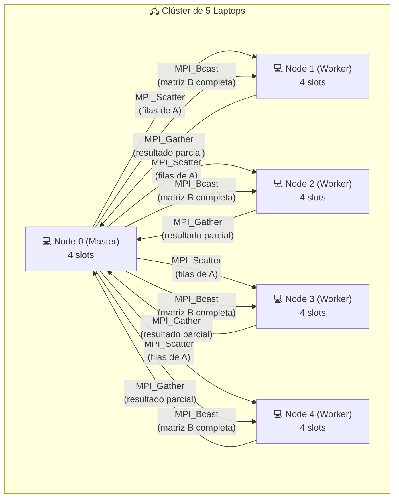
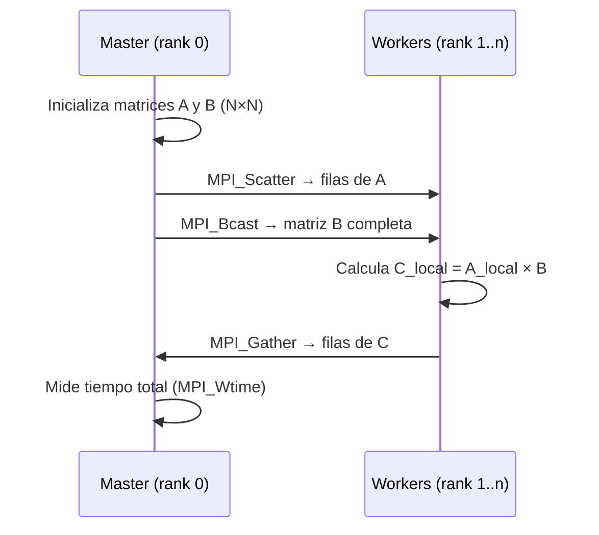

# MatrixMultiplicationDistributed-Workshop — Multiplicación de Matrices Distribuida con MPI

Multiplicación de matrices cuadradas implementada en **C con MPI (OpenMPI)**, ejecutada sobre un **clúster de 5 laptops**. El proyecto evalúa el tiempo de ejecución variando el tamaño de las matrices y la cantidad de procesos MPI.

## Arquitectura



## Flujo de ejecución



## Algoritmo

1. El **Master** (rank 0) genera las matrices A y B de tamaño N×N
2. Las filas de A se **distribuyen equitativamente** entre todos los procesos (`MPI_Scatter`)
3. La matriz B se **difunde completa** a todos los procesos (`MPI_Bcast`)
4. Cada proceso calcula su porción de C = A × B (multiplicación fila × columna)
5. Los resultados parciales se **recolectan** en el Master (`MPI_Gather`)
6. Se mide el tiempo wall-clock con `MPI_Wtime()`

## Configuraciones experimentales

| Parámetro | Valores |
|-----------|---------|
| Tamaños de matriz (N) | 200, 400, 800, 1600, 3200 |
| Procesos MPI (np) | 4, 20 |
| Repeticiones por caso | 30 |
| Nodos del clúster | 5 laptops × 4 slots |

## Muestra de resultados

Ejemplo de tiempos obtenidos (primeras 5 ejecuciones):

| N | np | Run | Tiempo (s) |
|---|---:|----:|-----------:|
| 200 | 4 | 1 | 0.015608 |
| 200 | 4 | 2 | 0.015764 |
| 200 | 4 | 3 | 0.013351 |
| 200 | 4 | 4 | 0.006441 |
| 200 | 4 | 5 | 0.013686 |

Los resultados completos se encuentran en `LaptopNode0/Resultados/` y `LaptopNode0/results.csv`. El análisis se realiza en el notebook `analisis_resultados.ipynb`.

## Requisitos

- **OpenMPI** (`mpicc`, `mpirun`)
- **GCC** compatible con C99
- **Perl** (para el script de benchmarking)
- Configuración SSH sin contraseña entre nodos del clúster

## Compilación

```bash
cd LaptopNode0
mpicc -o matmul matmul.c
```

## Ejecución

### Ejecución manual (ejemplo con 4 procesos)

```bash
mpirun -np 4 --hostfile hostfile ./matmul 800
```

### Benchmark automatizado (30 repeticiones × todas las configuraciones)

```bash
perl benchmark_mpi.pl
```

Esto genera archivos CSV como `matricesde800_np4.csv` con los tiempos de cada ejecución.

## Hostfile

El archivo `hostfile` define los nodos del clúster y sus slots disponibles:

```
node0 slots=4
node1 slots=4
node2 slots=4
node3 slots=4
node4 slots=4
```

> Cada laptop aporta 4 slots, para un total de 20 procesos MPI máximos.

## Estructura del proyecto

```
MatrixMultiplicationDistributed-Workshop/
├── README.md
├── analisis_resultados.ipynb       # Notebook de análisis de rendimiento
├── LaptopNode0/                    # Nodo master (código y resultados)
│   ├── matmul.c                    # Programa MPI de multiplicación
│   ├── hostfile                    # Definición de nodos del clúster
│   ├── benchmark_mpi.pl            # Script Perl de benchmarking
│   ├── results.csv                 # Resultados consolidados
│   └── Resultados/                 # CSVs por configuración
│       ├── matricesde200_np4.csv
│       ├── matricesde200_np20.csv
│       ├── matricesde400_np4.csv
│       ├── ...
│       └── matricesde3200_np20.csv
├── LaptopNode1/                    # Workers (copia del código + hostfile)
├── LaptopNode2/
├── LaptopNode3/
└── LaptopNode4/
```

## Tecnologías

- **C** — Lenguaje de implementación
- **MPI (OpenMPI)** — Comunicación distribuida (`Scatter`, `Bcast`, `Gather`)
- **Perl** — Automatización de benchmarks
- **CSV** — Formato de resultados
- **Jupyter Notebook** — Análisis de rendimiento
