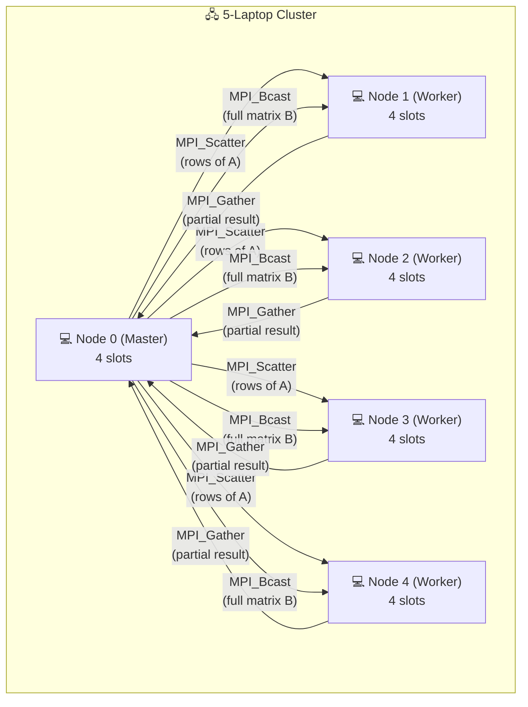
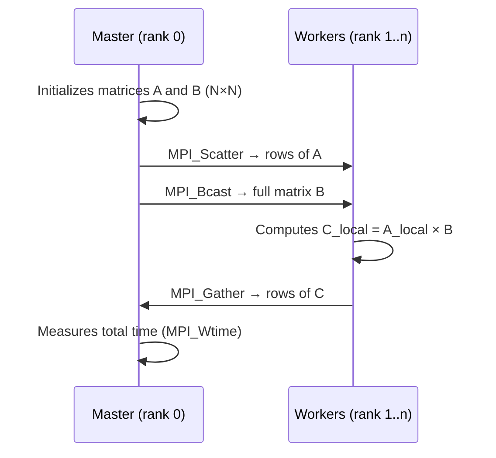

# MatrixMultiplicationDistributed-Workshop — Distributed Matrix Multiplication with MPI

Square matrix multiplication implemented in **C with MPI (OpenMPI)**, executed on a **5-laptop cluster**. The project evaluates execution time by varying the matrix size and the number of MPI processes.

## Architecture



## Execution Flow



## Algorithm

1. The **Master** (rank 0) generates matrices A and B of size N×N
2. The rows of A are **distributed evenly** across all processes (`MPI_Scatter`)
3. Matrix B is **broadcast in full** to all processes (`MPI_Bcast`)
4. Each process computes its portion of C = A × B (row-by-column multiplication)
5. The partial results are **collected** by the Master (`MPI_Gather`)
6. Wall-clock time is measured with `MPI_Wtime()`

## Experimental Configurations

| Parameter | Values |
|-----------|---------|
| Matrix sizes (N) | 200, 400, 800, 1600, 3200 |
| MPI processes (np) | 4, 20 |
| Repetitions per case | 30 |
| Cluster nodes | 5 laptops × 4 slots |

## Sample Results

Example of the times obtained (first 5 runs):

| N | np | Run | Time (s) |
|---|---:|----:|-----------:|
| 200 | 4 | 1 | 0.015608 |
| 200 | 4 | 2 | 0.015764 |
| 200 | 4 | 3 | 0.013351 |
| 200 | 4 | 4 | 0.006441 |
| 200 | 4 | 5 | 0.013686 |

The complete results are located in `LaptopNode0/Resultados/` and `LaptopNode0/results.csv`. The analysis is carried out in the `analisis_resultados.ipynb` notebook.

## Requirements

- **OpenMPI** (`mpicc`, `mpirun`)
- **GCC** compatible with C99
- **Perl** (for the benchmarking script)
- Passwordless SSH configuration between cluster nodes

## Compilation

```bash
cd LaptopNode0
mpicc -o matmul matmul.c
```

## Execution

### Manual Execution (example with 4 processes)

```bash
mpirun -np 4 --hostfile hostfile ./matmul 800
```

### Automated Benchmark (30 repetitions × all configurations)

```bash
perl benchmark_mpi.pl
```

This generates CSV files such as `matricesde800_np4.csv` with the time for each run.

## Hostfile

The `hostfile` file defines the cluster nodes and their available slots:

```
node0 slots=4
node1 slots=4
node2 slots=4
node3 slots=4
node4 slots=4
```

> Each laptop contributes 4 slots, for a total of 20 maximum MPI processes.

## Project Structure

```
MatrixMultiplicationDistributed-Workshop/
├── README.md
├── analisis_resultados.ipynb       # Performance analysis notebook
├── LaptopNode0/                    # Master node (code and results)
│   ├── matmul.c                    # MPI matrix multiplication program
│   ├── hostfile                    # Cluster node definition
│   ├── benchmark_mpi.pl            # Perl benchmarking script
│   ├── results.csv                 # Consolidated results
│   └── Resultados/                 # CSVs by configuration
│       ├── matricesde200_np4.csv
│       ├── matricesde200_np20.csv
│       ├── matricesde400_np4.csv
│       ├── ...
│       └── matricesde3200_np20.csv
├── LaptopNode1/                    # Workers (copy of the code + hostfile)
├── LaptopNode2/
├── LaptopNode3/
└── LaptopNode4/
```

## Technologies

- **C** — Implementation language
- **MPI (OpenMPI)** — Distributed communication (`Scatter`, `Bcast`, `Gather`)
- **Perl** — Benchmark automation
- **CSV** — Results format
- **Jupyter Notebook** — Performance analysis
