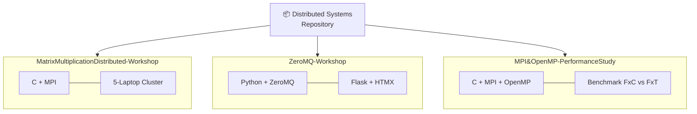
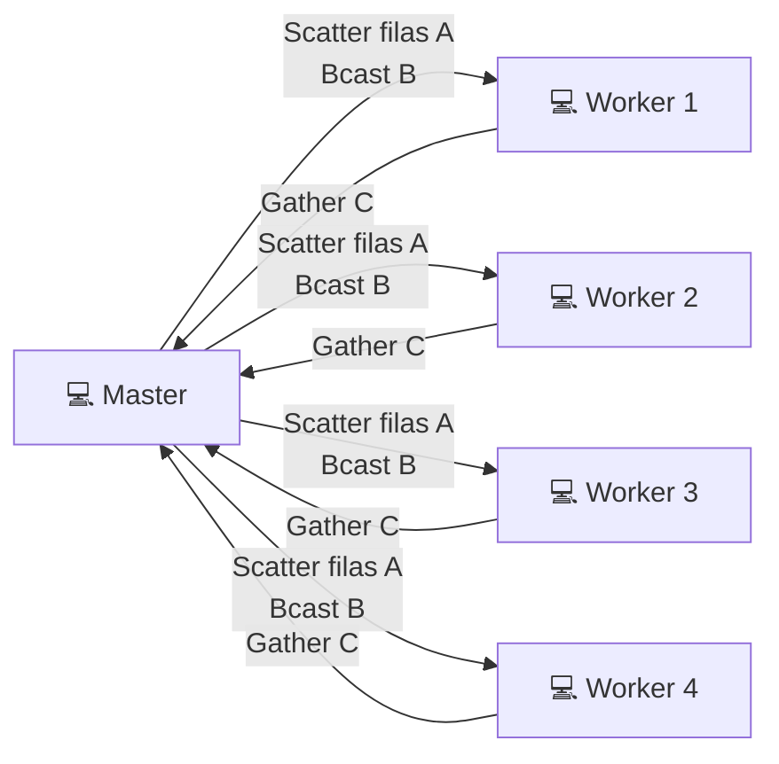
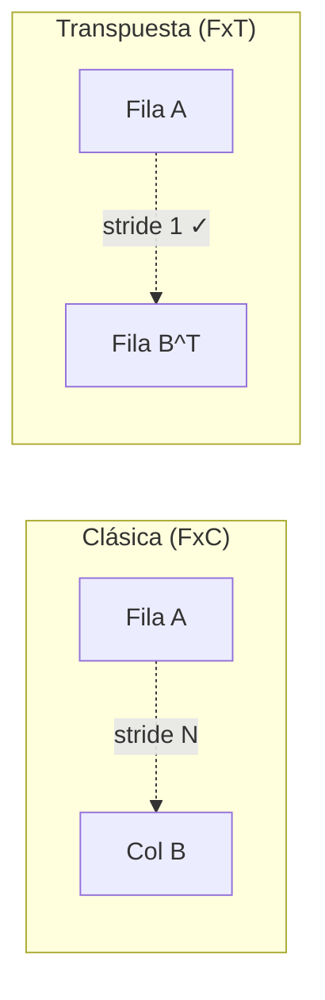

# Distributed Systems & Initial Studies for High Performance Computing

This repository contains the projects developed related to Distributed Systems, High Performance Computing (HPC), and Parallel Programming.

Each directory corresponds to a subproject with its own implementation, experiments, and documentation.  
Please see below the structure and description of each directory.

The repository combines both **implementation-oriented workshops** and **performance-focused experimental studies**.

---

## General Overview



At a high level, the repository includes three main lines of work:

- **Distributed matrix multiplication with MPI**, executed in a small cluster environment
- **A distributed library system with ZeroMQ**, exposed through a lightweight web interface
- **A hybrid MPI + OpenMP performance study**, focused on comparing parallelization strategies

This makes the repository includes topics related to:

- Distributed Systems
- Parallel Programming
- High Performance Computing
- Experimental performance evaluation (Benchmarks)

---

## Repository Structure

### 1. MatrixMultiplicationDistributed-Workshop

Distributed square matrix multiplication implemented in **C using MPI (OpenMPI)** and executed on a **5-laptop cluster**.  
The project evaluates execution time while varying matrix sizes and the number of MPI processes.



**Mini-muestra de resultados:**

| N | np | Tiempo promedio (s) |
|---:|---:|---:|
| 200 | 4 | ~0.013 |
| 800 | 4 | ~0.35 |
| 3200 | 20 | ~12.5 |

  - Work division by rows across MPI ranks  
  - Communication using `MPI_Scatter`, `MPI_Bcast`, and `MPI_Gather`  
  - Wall-time measurement with `MPI_Wtime()`  
  - Automated benchmarking (30 runs per configuration)  
  - CSV result generation for performance analysis  
  - **[Full README](MatrixMultiplicationDistributed-Workshop/README.md)** with architecture diagrams and execution details

---

### 2. ZeroMQ-Workshop

Distributed library management system implemented with **Python, ZeroMQ, Flask, and HTMX**, following a **client–server architecture** with JSON-based message exchange.


**Mini-muestra de protocolo:**
```json
// Petición
{ "action": "Prestamo por ISBN", "isbn": "9780307474278", "borrower": "Juan" }
// Respuesta
{ "success": true, "message": "Préstamo exitoso: 'Cien años de soledad'" }
```

  - REQ–REP communication pattern using ZeroMQ  
  - Loan by ISBN or title, book query, and return operations  
  - JSON-based persistence and configurable ports/IPs  
  - **[Full README](ZeroMQ-Workshop/README.md)** with architecture, data model, and execution guide

---

### 3. MPI&OpenMP-PerformanceStudy

Hybrid parallel matrix multiplication performance study implemented in **C using MPI and OpenMP**, comparing a **classic row-by-column approach** against a **transposed-matrix variant**.



**Diseño experimental:**

| Caso | Variable | Valores |
|------|----------|---------|
| 1 | Procesos MPI | np = 5, 17, 33 (hilos=1) |
| 2 | Hilos OpenMP | nH = 1, 4, 8 (np=5) |
| 3 | Línea base | np=2, nH=1 (mismo nodo) |

  - Hybrid parallelism with MPI across nodes and OpenMP within each worker  
  - Two multiplication strategies: classical and transposed  
  - Automated benchmarking with 30 repetitions per configuration  
  - `.dat` result generation and Makefile-based build  
  - **[Full README](MPI&OpenMP-PerformanceStudy/README.md)** with architecture diagrams and all experimental details

---

## Technologies Used

Across the different subprojects:

- **C / MPI (OpenMPI) / OpenMP**
- **Python**
- **ZeroMQ**
- **Flask + HTMX**
- **JSON / CSV for data handling**
- **Perl scripts for automated benchmarking**
- **Linux-based cluster environments**

---

## Basic Requirements

Depending on the subproject, the main tools required are:

- **OpenMPI / `mpicc` / `mpirun`**
- **OpenMP-compatible C compiler**
- **Python 3.10+**
- **pip** for Python dependencies

Some experiments were designed for multi-node or multi-machine execution, so hostfile-based setups and Linux environments are assumed in several directories.

---

## Notes

- Each subproject contains its own detailed `README.md` with architecture diagrams and execution instructions.
- Experimental result files (`.csv`, `.dat`) are preserved in the repository as part of the analysis workflow.
- The `ZeroMQ-Workshop` subproject already includes a dedicated README with setup and architecture details.
- PDF reports included in the repository complement the implementation with methodology and performance discussion.
