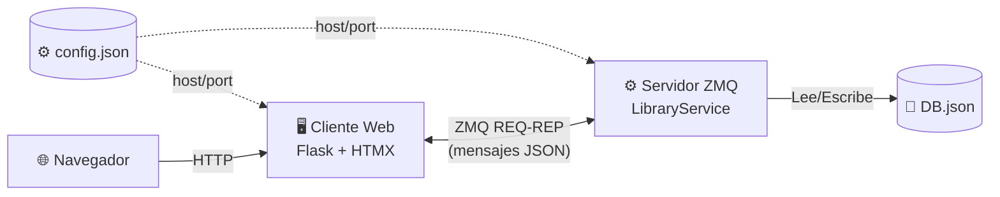

# RMI-Workshop — Sistema de Biblioteca ZeroMQ

Sistema de gestión de biblioteca implementado con **ZeroMQ** (comunicación cliente-servidor) y **Flask + HTMX** (interfaz web). Los puertos e IPs se configuran desde `config.json`.

## Arquitectura



## Operaciones disponibles

| Operación | Acción ZMQ | Descripción |
|-----------|------------|-------------|
| Préstamo por ISBN | `Prestamo por ISBN` | Presta un libro buscándolo por su ISBN |
| Préstamo por Título | `Prestamo por Titulo` | Presta un libro buscándolo por título |
| Consulta por ISBN | `Consulta por ISBN` | Consulta la información de un libro |
| Devolución por ISBN | `Devolucion por ISBN` | Devuelve un libro prestado |

## Modelo de datos

Cada libro en `DB.json` tiene la siguiente estructura:

| Campo | Tipo | Descripción |
|-------|------|-------------|
| `ISBN` | `string` | Identificador único del libro |
| `titulo` | `string` | Título del libro |
| `autores` | `string[]` | Lista de autores |
| `estado` | `string` | `"prestado"` o `"no prestado"` |
| `prestatario` | `string \| null` | Nombre de quien tiene el libro prestado |
| `fecha_prestamo` | `string \| null` | Fecha de préstamo (ISO 8601) |
| `fecha_devolucion` | `string \| null` | Fecha límite de devolución (ISO 8601) |

## Configuración

El archivo `config.json` en la raíz del proyecto centraliza puertos e IPs:

```json
{
    "server": {
        "host": "*",
        "port": 5555
    },
    "client": {
        "server_host": "localhost",
        "server_port": 5555
    },
    "web": {
        "host": "0.0.0.0",
        "port": 5000,
        "debug": true
    }
}
```

| Sección | Descripción |
|---------|-------------|
| `server` | Dirección de bind del servidor ZMQ (`host:port`) |
| `client` | Dirección del servidor ZMQ al que se conecta el cliente |
| `web` | Host, puerto y modo debug del servidor Flask |

## Requisitos

- Python 3.10+
- pip

## Instalación

```bash
pip install -r requirements.txt
```

## Ejecución

Se necesitan **dos terminales**:

### Terminal 1 — Servidor ZeroMQ
```bash
python -m server.main
```
El servidor escuchará en la dirección configurada en `config.json` → `server` (por defecto `tcp://*:5555`).

### Terminal 2 — Cliente Web
```bash
python -m client.app
```
Abrir el navegador en: [http://localhost:5000](http://localhost:5000) (o el puerto configurado en `config.json` → `web.port`).

## Protocolo de mensajes (JSON sobre ZMQ)

**Petición (préstamo):**
```json
{
  "action": "Prestamo por ISBN",
  "isbn": "9780307474278",
  "borrower": "Juan Pérez"
}
```

**Respuesta:**
```json
{
  "success": true,
  "message": "Préstamo exitoso: 'Cien años de soledad' prestado a Juan Pérez",
  "book": {
    "ISBN": "9780307474278",
    "titulo": "Cien años de soledad",
    "autores": ["Gabriel García Márquez"],
    "estado": "prestado",
    "prestatario": "Juan Pérez",
    "fecha_prestamo": "2026-02-23",
    "fecha_devolucion": "2026-03-09"
  }
}
```

## Estructura del proyecto

```
RMI-Workshop/
├── README.md
├── requirements.txt
├── config.json                # Configuración de puertos e IPs
├── DB.json                    # Base de datos de libros
├── .gitignore
├── server/
│   ├── __init__.py
│   ├── main.py                # Arranque del servidor ZMQ
│   ├── library_service.py     # Servicio ZMQ (REP socket)
│   └── db.py                  # Acceso a datos (DB.json)
├── client/
│   ├── __init__.py
│   ├── app.py                 # App Flask
│   ├── grpc_client.py         # Cliente ZMQ (REQ socket)
│   ├── templates/
│   │   ├── base.html
│   │   ├── index.html
│   │   └── partials/
│   │       ├── loan_result.html
│   │       ├── query_result.html
│   │       └── return_result.html
│   └── static/
│       └── style.css
```

## Tecnologías

- **ZeroMQ (pyzmq)** — Comunicación cliente-servidor (patrón REQ-REP)
- **Flask** — Framework web del lado del cliente
- **HTMX** — Interactividad sin JavaScript manual
- **JSON** — Persistencia de datos y protocolo de mensajes


