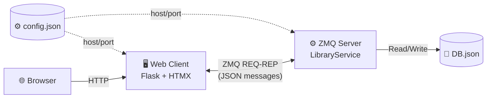

# RMI-Workshop — ZeroMQ Library System

A library management system implemented with **ZeroMQ** (client-server communication) and **Flask + HTMX** (web interface). Ports and IPs are configured from `config.json`.

## Architecture


```mermaid
graph LR
    Browser["🌐 Browser"]
    Config[("⚙️ config.json")]
    Client["🖥️ Web Client\nFlask + HTMX"]
    Server["⚙️ ZMQ Server\nLibraryService"]
    DB[("📁 DB.json")]

    Config -.->|host/port| Client
    Config -.->|host/port| Server
    Browser -->|HTTP| Client
    Client <-->|"ZMQ REQ-REP\n(JSON messages)"| Server
    Server -->|Read/Write| DB
```

## Available Operations

| Operation | ZMQ Action | Description |
|-----------|------------|-------------|
| Loan by ISBN | `Prestamo por ISBN` | Lends a book by searching for its ISBN |
| Loan by Title | `Prestamo por Titulo` | Lends a book by searching for its title |
| Query by ISBN | `Consulta por ISBN` | Queries the information of a book |
| Return by ISBN | `Devolucion por ISBN` | Returns a borrowed book |

## Data Model

Each book in `DB.json` has the following structure:

| Field | Type | Description |
|-------|------|-------------|
| `ISBN` | `string` | Unique identifier of the book |
| `titulo` | `string` | Book title |
| `autores` | `string[]` | List of authors |
| `estado` | `string` | `"prestado"` or `"no prestado"` |
| `prestatario` | `string \| null` | Name of the person who has the book on loan |
| `fecha_prestamo` | `string \| null` | Loan date (ISO 8601) |
| `fecha_devolucion` | `string \| null` | Return due date (ISO 8601) |

## Configuration

The `config.json` file at the root of the project centralizes ports and IPs:

```json
{
    "server": {
        "host": "*",
        "port": 5555
    },
    "client": {
        "server_host": "localhost",
        "server_port": 5555
    },
    "web": {
        "host": "0.0.0.0",
        "port": 5000,
        "debug": true
    }
}
```

| Section | Description | 
|---------|-------------|
| `server` | ZMQ server bind address (`host:port`) |
| `client` | Address of the ZMQ server the client connects to |
| `web` | Host, port, and debug mode of the Flask server |

## Requirements

- Python 3.10+
- pip

## Installation

```bash
pip install -r requirements.txt
```

## Execution

You need **two terminals**:

### Terminal 1 — ZeroMQ Server
```bash
python -m server.main
```
The server will listen on the address configured in `config.json` → `server` (default `tcp://*:5555`).

### Terminal 2 — Web Client
```bash
python -m client.app
```
Open the browser at: [http://localhost:5000](http://localhost:5000) (or the port configured in `config.json` → `web.port`).

## Message Protocol (JSON over ZMQ)

**Request (loan):**
```json
{
  "action": "Prestamo por ISBN",
  "isbn": "9780307474278",
  "borrower": "Juan Pérez"
}
```

**Response:**
```json
{
  "success": true,
  "message": "Préstamo exitoso: 'Cien años de soledad' prestado a Juan Pérez",
  "book": {
    "ISBN": "9780307474278",
    "titulo": "Cien años de soledad",
    "autores": ["Gabriel García Márquez"],
    "estado": "prestado",
    "prestatario": "Juan Pérez",
    "fecha_prestamo": "2026-02-23",
    "fecha_devolucion": "2026-03-09"
  }
}
```

## Project Structure

```
RMI-Workshop/
├── README.md
├── requirements.txt
├── config.json                # Port and IP configuration
├── DB.json                    # Book database
├── .gitignore
├── server/
│   ├── __init__.py
│   ├── main.py                # ZMQ server startup
│   ├── library_service.py     # ZMQ service (REP socket)
│   └── db.py                  # Data access (DB.json)
├── client/
│   ├── __init__.py
│   ├── app.py                 # Flask app
│   ├── grpc_client.py         # ZMQ client (REQ socket)
│   ├── templates/
│   │   ├── base.html
│   │   ├── index.html
│   │   └── partials/
│   │       ├── loan_result.html
│   │       ├── query_result.html
│   │       └── return_result.html
│   └── static/
│       └── style.css
```

## Technologies

- **ZeroMQ (pyzmq)** — Client-server communication (REQ-REP pattern)
- **Flask** — Client-side web framework
- **HTMX** — Interactivity without manual JavaScript
- **JSON** — Data persistence and message protocol


